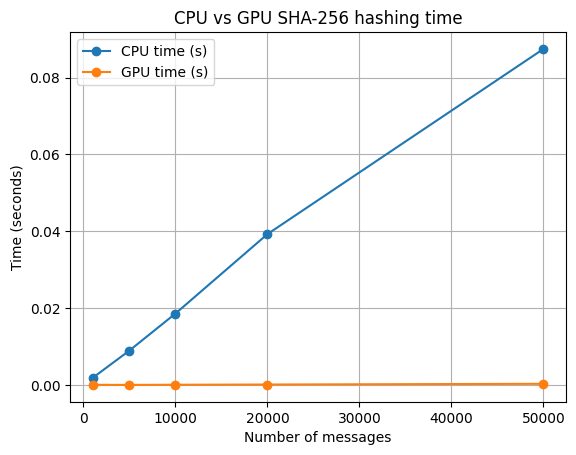
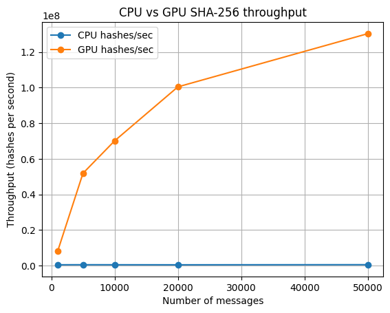

# GPU Programming – Assignment 2

### SHA-256 Hashing on GPU (Numba CUDA)

**Course:** GPU Programming  
**Assignment:** Implement a Cryptography Algorithm on GPU (Problem 4 – SHA / MD5 Hashing)

---

## Team Members

| Name                     | Roll Number |
| ------------------------ | ----------: |
| Akula Rajesh             |   M25AI1048 |
| Pradeep Annepu           |   M25AI1109 |
| Anirudh Reddy Aligireddy |   M25AI1131 |
| V Amarendra Chakravarthi |   M25AI1082 |

---

## 1. Introduction

In this assignment we implemented **SHA-256**, a standard cryptographic hash function, and ran it on both:

- **CPU** – using Python’s built-in `hashlib`, and
- **GPU** – using a custom **Numba CUDA** kernel.

The main idea is simple:

> We have many small, independent messages. Each message’s hash can be computed independently, so we run one GPU thread per message and compare it with a CPU loop.

This matches **Problem 4 – SHA / MD5 Hashing: compute digests in parallel for large datasets**, and helps us understand how well GPUs can speed up a classic security-related workload.

---

## 2. Problem Statement

**Given:**  
A large batch of short messages `M₁, M₂, …, Mₙ` (strings of length up to 40–55 bytes).

**Task:**

1. Compute SHA-256 hashes for all messages on the **CPU** using Python `hashlib`.
2. Compute SHA-256 hashes for all messages on the **GPU**, using:
   - Numba CUDA,
   - one CUDA thread per message,
   - an implementation of the SHA-256 compression function.
3. Compare:
   - correctness (CPU hash vs GPU hash),
   - total time (seconds),
   - and **speed / throughput** (hashes per second) for different values of N.

**Assumptions / limits:**

- Each message is short enough to fit into **one 512-bit block** (i.e., original length ≤ 55 bytes).
- Multi-block messages and streaming SHA-256 are **not** implemented.

---

## 3. Dataset / Workload

We did not use a fixed public dataset here. Instead, we generated synthetic data:

- **Messages:**

  - Each message is a random string of length between **5 and 40** characters.
  - Characters are chosen from: `a–z` and `0–9`.
  - We encode each string as UTF-8 bytes before hashing.

- **Batch sizes (N):**  
  We tested the implementation for:
  - `N = 1,000`
  - `N = 5,000`
  - `N = 10,000`
  - `N = 20,000`
  - `N = 50,000`

This is meant to simulate a realistic scenario like hashing many small records: log lines, identifiers, or other short fields.

---

## 4. Implementation Details

### 4.1 CPU Baseline (hashlib)

The CPU version is straightforward:

- Loop over all messages.
- For each message `m`:

```python
import hashlib

digest = hashlib.sha256(m).digest()  # 32-byte result
```

- Store the digest in a NumPy array of shape `(N, 32)` with `dtype=uint8`.
- Measure:
  - total CPU time in seconds,
  - CPU throughput = `N / cpu_time` (hashes per second).

This CPU result is used both as:

- a **correctness reference**, and
- the **performance baseline** to compare with the GPU.

---

### 4.2 SHA-256 Padding (Host Side)

For each message we implement the standard SHA-256 padding, assuming the message fits in a single block:

1. Start with the message bytes.
2. Append `0x80` (binary `10000000`).
3. Append `0x00` bytes until the total length is **56 bytes**.
4. Append the original message length in **bits** as a 64-bit big-endian integer.
5. Final length = `64` bytes = `512` bits.

We assert that the original message length is ≤ 55 bytes so that one padded block is enough.

---

### 4.3 GPU Implementation (Numba CUDA)

We implemented the **SHA-256 compression function** on the GPU:

- **Constants:**

  - Initial hash values `H0[0..7]` (fixed 32-bit words).
  - Round constants `K[0..63]`.

- **Device helper functions:**

  - `to_uint32(x)` to keep everything in 32-bit unsigned range.
  - Bitwise ops:
    - `rotr(x, n)` – rotate right,
    - `shr(x, n)` – logical right shift.
  - Sigma functions:
    - `big_sigma0`, `big_sigma1`,
    - `small_sigma0`, `small_sigma1`.
  - Logic functions:
    - `ch(x, y, z)` (choice),
    - `maj(x, y, z)` (majority).

- **CUDA kernel (`sha256_kernel`) flow:**
  1. **Each thread** gets an index `idx` and handles **one message**.
  2. Load the 64-byte padded block into a local message schedule array `W[0..63]`:
     - `W[0..15]` from the block (big-endian),
     - `W[16..63]` computed using the σ functions and previous words.
  3. Initialize working variables `a..h` from `H0`.
  4. Run the 64-round compression loop.
  5. Add the result back to `H0` and write the final 8 words (`a..h`) into `digests[idx]` as 32 bytes (big-endian).

---

### 4.4 Parallelization & Launch Configuration

For a batch of N messages:

- We create a NumPy array `blocks` of shape `(N, 64)` containing all padded message blocks.
- Copy `blocks` to GPU (`d_blocks`).
- Allocate `d_digests` on GPU with shape `(N, 32)` for outputs.

Launch parameters:

```python
threads_per_block = 128
blocks_per_grid = (N + threads_per_block - 1) // threads_per_block
sha256_kernel[blocks_per_grid, threads_per_block](d_blocks, d_digests)
```

So:

- each thread processes **one message**,
- there are enough threads to cover all N messages.

We also run a **warmup kernel launch** once to avoid counting JIT compilation time inside our timing.

---

## 5. Experimental Setup

**Environment:**

- Python (Jupyter Notebook – `M25AI1048_M25AI1109_M25AI1131_M25AI1082.ipynb`)
- Packages: `numpy`, `numba`, `hashlib`, `matplotlib`
- Hardware (example, Colab-style environment):
  - CPU: virtual Intel Xeon
  - GPU: NVIDIA GPU (e.g., T4)
  - OS: Linux

**Batch sizes:**

We ran:

- N = 1,000
- N = 5,000
- N = 10,000
- N = 20,000
- N = 50,000

For each N we measured:

- CPU time (seconds)
- GPU time (seconds, kernel only)
- CPU speed (hashes/sec)
- GPU speed (hashes/sec)
- Speedup = CPU time / GPU time

---

## 6. Results

### 6.1 Numerical Results

From the notebook run, we obtained:

```text
===== N = 1000 messages =====
CPU time : 0.0019 s  (523,699 hashes/sec)
GPU time : 0.0001 s  (8,128,496 hashes/sec)

===== N = 5000 messages =====
CPU time : 0.0090 s  (554,055 hashes/sec)
GPU time : 0.0001 s  (51,909,703 hashes/sec)

===== N = 10000 messages =====
CPU time : 0.0186 s  (536,603 hashes/sec)
GPU time : 0.0001 s  (70,138,863 hashes/sec)

===== N = 20000 messages =====
CPU time : 0.0393 s  (509,058 hashes/sec)
GPU time : 0.0002 s  (100,462,371 hashes/sec)

===== N = 50000 messages =====
CPU time : 0.0874 s  (571,874 hashes/sec)
GPU time : 0.0004 s  (130,338,844 hashes/sec)
```

Overall summary:

```text
N =   1000 | CPU: 0.0019s (523,699 h/s)  | GPU: 0.0001s (8,128,496 h/s)   | Speedup:  15.52x
N =   5000 | CPU: 0.0090s (554,055 h/s)  | GPU: 0.0001s (51,909,703 h/s)  | Speedup:  93.69x
N =  10000 | CPU: 0.0186s (536,603 h/s)  | GPU: 0.0001s (70,138,863 h/s)  | Speedup: 130.71x
N =  20000 | CPU: 0.0393s (509,058 h/s)  | GPU: 0.0002s (100,462,371 h/s) | Speedup: 197.35x
N =  50000 | CPU: 0.0874s (571,874 h/s)  | GPU: 0.0004s (130,338,844 h/s) | Speedup: 227.92x
```

We can summarize this in a table:

| N (messages) | CPU time (s) | GPU time (s) | CPU speed (hashes/sec) | GPU speed (hashes/sec) | Speedup (CPU/GPU) |
| -----------: | -----------: | -----------: | ---------------------: | ---------------------: | ----------------: |
|        1,000 |       0.0019 |       0.0001 |                523,699 |              8,128,496 |            15.52× |
|        5,000 |       0.0090 |       0.0001 |                554,055 |             51,909,703 |            93.69× |
|       10,000 |       0.0186 |       0.0001 |                536,603 |             70,138,863 |           130.71× |
|       20,000 |       0.0393 |       0.0002 |                509,058 |            100,462,371 |           197.35× |
|       50,000 |       0.0874 |       0.0004 |                571,874 |            130,338,844 |           227.92× |

For each N, we also verified a sample of digests and they matched between CPU and GPU.

---

### 6.2 Visualizations

In the notebook we generated two plots:

1. **CPU vs GPU time (seconds)** vs batch size N
2. **CPU vs GPU throughput (hashes/sec)** vs batch size N

If these are saved as:

- `images/cpu_gpu_time.png`
- `images/cpu_gpu_throughput.png`

we can reference them here.

#### 6.2.1 CPU vs GPU Time



This plot shows that CPU time grows linearly with N, while GPU kernel time stays very low, especially for larger N.

#### 6.2.2 CPU vs GPU Throughput



Here we see:

- CPU throughput is around ~0.5–0.57 million hashes/sec,
- GPU throughput increases up to ~130 million hashes/sec,
- giving a speedup of more than 200× for N = 50,000.

---

## 7. Discussion

- **Parallelism:**  
  The problem is embarrassingly parallel. Each message hash is independent, so assigning one thread per message fits the GPU model very well.

- **Impact of Batch Size:**  
  For small N (like 1,000), GPU overheads matter more, so speedup is smaller (~15×).  
  As N increases, GPU utilization improves and we see speedups above ~200×.

- **Correctness:**  
  The tricky part of SHA-256 is handling:

  - 32-bit overflow,
  - rotations and shifts,
  - and big-endian word construction.  
    Our GPU implementation matches `hashlib.sha256` on sampled messages for all tested N, which gives us confidence in correctness under the single-block assumption.

- **Security Perspective:**  
  These results demonstrate how fast GPUs can hash data. This is good for integrity checks and deduplication, but also illustrates why **password hashing** should use slow, salt-and-stretch algorithms (like bcrypt/Argon2) instead of raw SHA-256.

---

## 8. Limitations

- Only **single-block** SHA-256 is supported (messages ≤ 55 bytes).
- Multi-block messages and streaming are not handled.
- We focused on **kernel time** on the GPU, not the full host–device transfer overhead in detail.
- Only SHA-256 was implemented (no MD5 or AES in this assignment).

---

## 9. Conclusion

We implemented and tested **SHA-256 hashing on GPU** using Numba CUDA and compared it to a CPU `hashlib` baseline.

Main takeaways:

- GPU can process large batches of small messages with **very high throughput**.
- For N up to 50,000 messages, the speedup reaches **~228×** over the CPU.
- The implementation demonstrates:
  - custom CUDA kernels,
  - bit-level operations on the GPU,
  - and practical measurement of performance and speedup.

This assignment clearly shows how GPUs can accelerate not only deep learning workloads, but also **cryptographic and data-processing tasks** that are inherently parallel.
